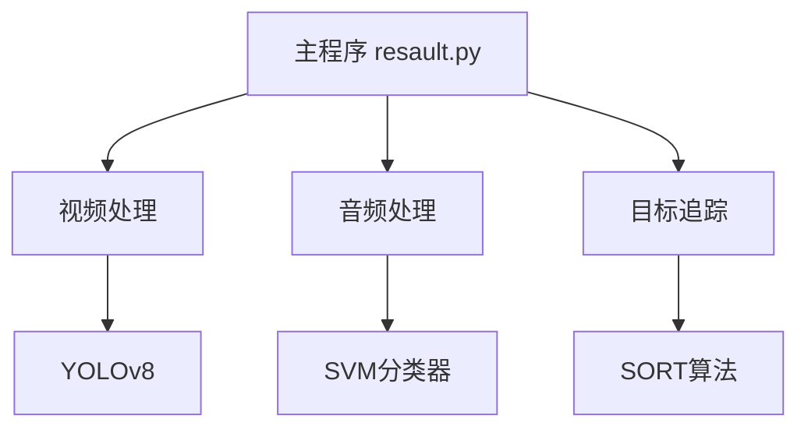
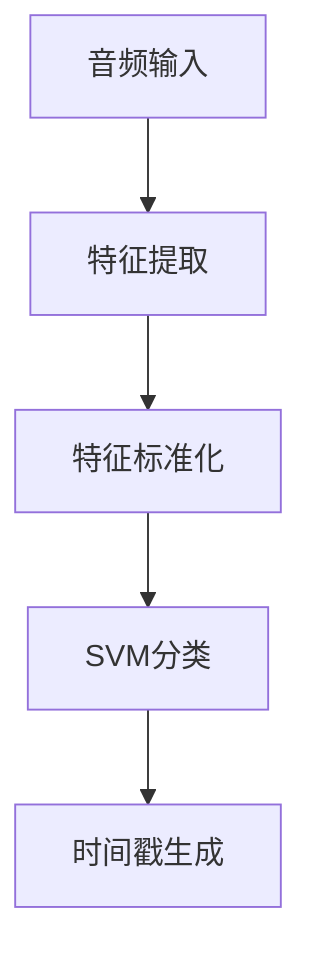
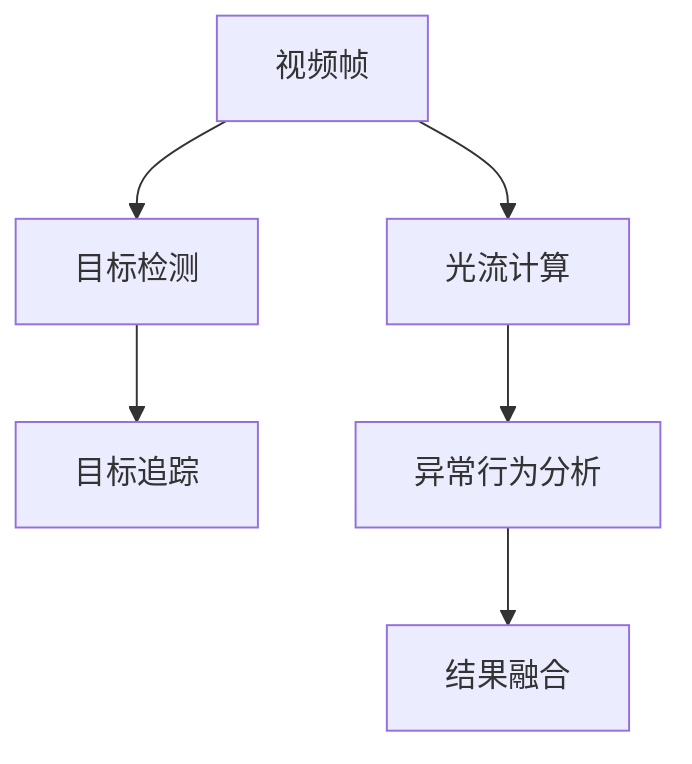
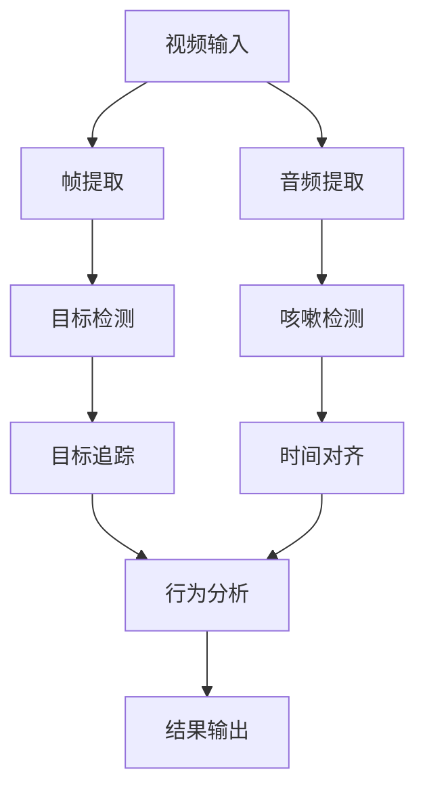

# pigs_health_recognition
This project implements a pig health monitoring system using audio-visual fusion and deep learning. It combines audio signals (coughing, breathing) and video data (behavioral changes) for accurate, real-time health assessment. The system features noise robustness, real-time performance, and cross-modal knowledge distillation.


# 猪只健康状况检测系统技术说明文档

## 目录
1. [系统概述](#1-系统概述)
2. [系统架构](#2-系统架构)
3. [核心模块说明](#3-核心模块说明)
4. [算法实现](#4-算法实现)
5. [数据流程](#5-数据流程)
6. [部署指南](#6-部署指南)
7. [性能优化](#7-性能优化)
8. [维护指南](#8-维护指南)
9. [注意事项](#9-注意事项)
10. [未来优化方向](#10-未来优化方向)

## 1. 系统概述

### 1.1 项目背景
本系统旨在通过计算机视觉和音频分析技术，实现对养殖场中猪只健康状况的自动监测，特别是对咳嗽症状的识别和追踪。

### 1.2 功能特性
- 实时视频监控分析
- 音频咳嗽检测
- 目标追踪与识别
- 异常行为分析
- 多模态数据融合
- 可视化结果输出

### 1.3 技术栈
- 编程语言：Python 3.x
- 视觉处理：OpenCV, YOLOv8
- 音频处理：librosa
- 机器学习：scikit-learn, PyTorch
- 目标追踪：SORT算法
- 数据处理：NumPy, Pandas

## 2. 系统架构

### 2.1 目录结构
```
pigs_health_recognition/
├── src/
│   ├── video_processing/
│   │   ├── runs/
│   │   │   └── resault.py          # 主运行文件
│   │   ├── object_detection.py      # 目标检测模块
│   │   └── runs/
│   │       └── detect/
│   │           └── train5/
│   │               └── weights/     # 模型权重
│   ├── audio_processing/
│   │   ├── stand.py                 # 音频训练模块
│   │   ├── model.py                 # 音频预测模块
│   │   └── scaler.joblib           # 特征标准化器
│   └── utils/                       # 工具函数
├── sort/                            # 目标追踪模块
├── data/
│   ├── video/                       # 视频数据
│   └── audio/
│       ├── cough/                   # 咳嗽音频样本
│       └── non_cough/               # 非咳嗽音频样本
├── output/                          # 输出结果
└── requirements.txt                 # 项目依赖
```

### 2.2 模块依赖关系


## 3. 核心模块说明

### 3.1 视频处理模块

#### 3.1.1 目标检测
```python
def detect_pigs_and_update_tracker(
    sort_tracker, frame, yolo_model,
    conf_threshold, class_ids,
    output_dir=None, frame_idx=None
):
    """
    执行猪只检测并更新追踪器
    参数:
        sort_tracker: SORT追踪器实例
        frame: 当前帧
        yolo_model: YOLOv8模型
        conf_threshold: 置信度阈值
        class_ids: 目标类别ID
    返回:
        检测到的目标列表 [(x,y,w,h,conf), ...]
    """
```

#### 3.1.2 光流分析
```python
def calculate_optical_flow(prev_frame, current_frame, output_dir, idx):
    """
    计算光流特征
    使用Farneback算法计算密集光流
    """
```

### 3.2 音频处理模块

#### 3.2.1 特征提取
```python
def extract_features(audio_path):
    """
    提取音频特征
    - MFCC特征 (13维)
    - Chroma特征 (12维)
    - Spectral Contrast特征 (6维)
    """
```

#### 3.2.2 模型训练
```python
# SVM分类器训练
model = SVC(kernel='linear', probability=True)
model.fit(features_scaled, labels)
```

### 3.3 目标追踪模块

#### 3.3.1 SORT算法实现
```python
class Sort(object):
    """
    SORT多目标追踪算法
    - 使用卡尔曼滤波预测
    - 使用匈牙利算法关联
    """
```

## 4. 算法实现

### 4.1 咳嗽检测算法流程

#### 4.1.1 音频检测


#### 4.1.2 视频分析


### 4.2 关键参数配置

```python
# 检测参数
DETECTION_PARAMS = {
    'conf_threshold': 0.5,
    'nms_threshold': 0.4,
    'class_ids': [0]  # 猪只类别
}

# 追踪参数
TRACKING_PARAMS = {
    'max_distance': 100,
    'use_clustering': True,
    'eps': 50,
    'min_samples': 5
}

# 光流参数
FLOW_PARAMS = {
    'optical_flow_threshold': 0.1,
    'time_window': 0.2,
    'flow_magnitude_threshold': 0.1
}
```

## 5. 数据流程

### 5.1 输入数据处理
1. 视频输入
   - 格式要求：MP4
   - 分辨率：建议 1920x1080
   - 帧率：25fps

2. 音频输入
   - 格式：WAV
   - 采样率：44100Hz
   - 通道数：2

### 5.2 处理流程


## 6. 部署指南

### 6.1 环境配置
```bash
# 1. 创建虚拟环境
python -m venv .venv
source .venv/bin/activate  # Linux/Mac
.venv\Scripts\activate     # Windows

# 2. 安装依赖
pip install -r requirements.txt

# 3. 安装额外依赖
pip install ffmpeg-python
```

### 6.2 模型准备
1. YOLOv8模型权重
   - 路径：`src/video_processing/runs/detect/train5/weights/best.pt`

2. 音频模型
   - 分类器：`src/audio_processing/cough_classifier_model.joblib`
   - 标准化器：`src/audio_processing/scaler.joblib`

### 6.3 运行系统
```python
# 主程序运行
python src/video_processing/runs/resault.py
```

## 7. 性能优化

### 7.1 视频处理优化
1. 帧率优化
   - 根据硬件性能调整处理帧率
   - 实现跳帧处理机制

2. GPU加速
   - YOLOv8模型GPU推理
   - 光流计算GPU加速

### 7.2 音频处理优化
1. 特征提取优化
   - 使用多进程并行处理
   - 实现特征缓存机制

2. 实时处理优化
   - 使用缓冲区机制
   - 实现流式处理

### 7.3 内存优化
```python
# 示例：帧缓存管理
def manage_frame_buffer(frames, max_size=100):
    if len(frames) > max_size:
        frames.pop(0)  # 移除最旧的帧
```

## 8. 维护指南

### 8.1 日志系统
```python
# 日志配置
logging.basicConfig(
    level=logging.DEBUG,
    format='%(asctime)s - %(levelname)s - %(message)s'
)
```

### 8.2 错误处理
```python
try:
    # 处理逻辑
    process_video_frame()
except Exception as e:
    logging.error(f"处理失败: {e}")
    # 错误恢复机制
```

### 8.3 模型更新
1. YOLOv8模型更新
   - 收集新数据
   - 重新训练模型
   - 更新权重文件

2. 音频模型更新
   - 扩充音频样本
   - 重新训练SVM
   - 更新模型文件

### 8.4 性能监控
1. 系统监控指标
   - CPU使用率
   - 内存占用
   - GPU利用率
   - 处理帧率

2. 准确率监控
   - 检测准确率
   - 追踪稳定性
   - 咳嗽识别准确率

## 9. 注意事项

### 9.1 系统限制
1. 硬件要求
   - 最小内存：8GB
   - 推荐GPU：NVIDIA GTX 1660或更高
   - 存储空间：至少20GB

2. 性能限制
   - 最大处理分辨率：1920x1080
   - 最大处理帧率：30fps
   - 同时追踪目标数：≤50

### 9.2 常见问题解决
1. 模型加载失败
   - 检查模型文件完整性
   - 验证CUDA版本兼容性
   - 确认内存充足

2. 音频处理错误
   - 检查音频文件格式
   - 验证ffmpeg安装
   - 确认采样率设置

3. 追踪不稳定
   - 调整追踪参数
   - 优化检测阈值
   - 增加光流分析精度

详情可以联系：626291605@qq.com

[技术说明文档.md](https://github.com/user-attachments/files/18822118/default.md)
